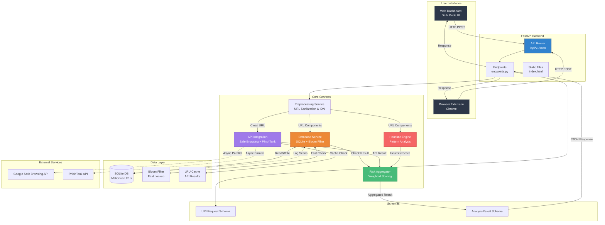
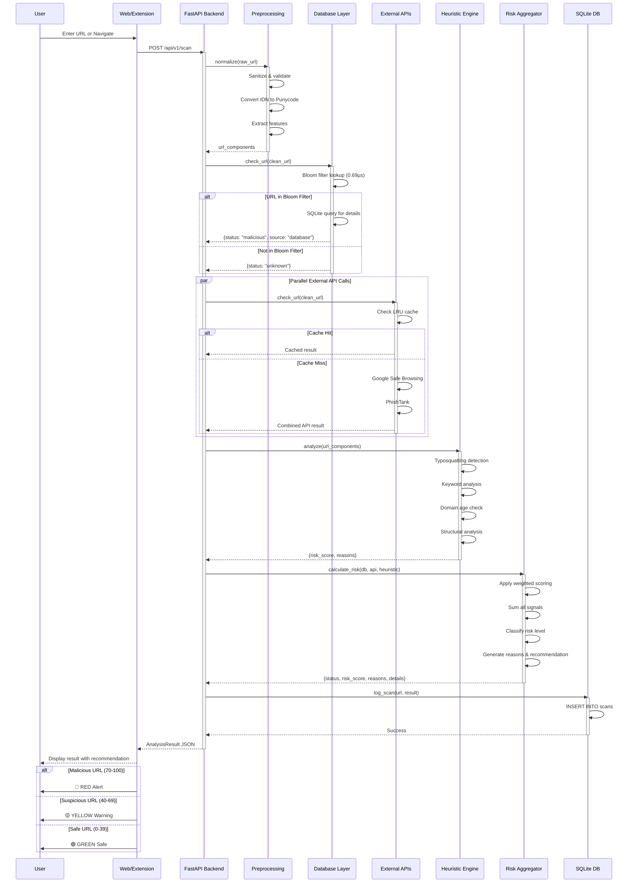
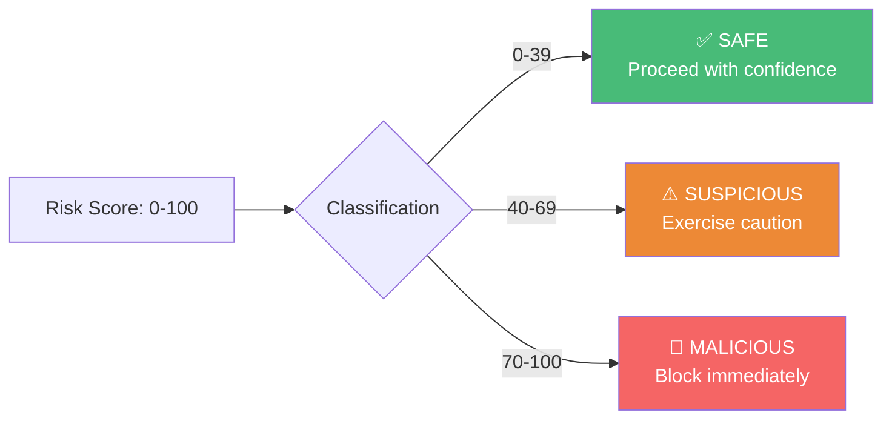
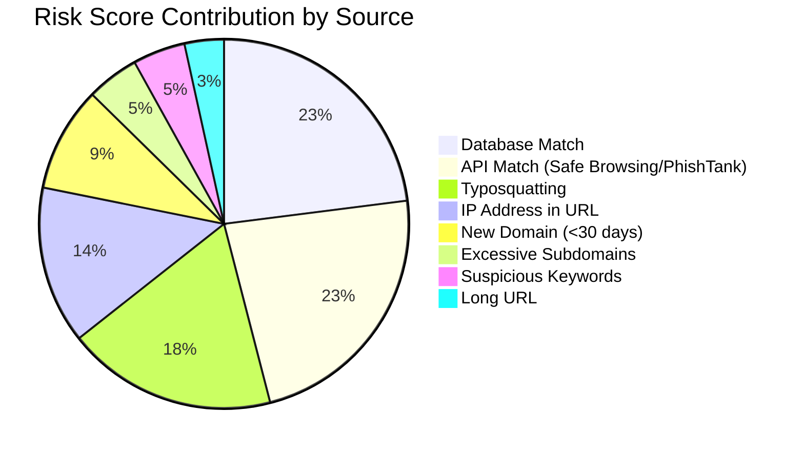

# Phishing Detection System - Diagrams

This document contains Mermaid diagrams illustrating the system's architecture, data flow, and workflow.

---

## 1. System Architecture Diagram

---

## 2. Data Flow Diagram

```mermaid
flowchart LR
    subgraph "Input"
        U1[User enters URL<br/>via Web Dashboard]
        U2[Browser Extension<br/>detects navigation]
    end
    
    subgraph "Phase 0: Preprocessing"
        P1[Sanitize URL<br/>Remove whitespace]
        P2[Validate Protocol<br/>Add http:// if missing]
        P3[IDN Conversion<br/>Unicode → Punycode]
        P4[Feature Extraction<br/>domain, TLD, path, query]
    end
    
    subgraph "Phase 1: Database Layer"
        D1{Bloom Filter<br/>Check}
        D2[SQLite Lookup<br/>Get metadata]
        D3[Return DB Result<br/>risk_score, source]
    end
    
    subgraph "Phase 2: API Layer"
        A1[Check Cache<br/>LRU 5min TTL]
        A2[Parallel API Calls]
        A3[Google Safe Browsing]
        A4[PhishTank]
        A5[Combine Results]
    end
    
    subgraph "Phase 3: Heuristic Layer"
        H1[Typosquatting Check<br/>9 brands, 70% similarity]
        H2[Keyword Analysis<br/>9 suspicious terms]
        H3[Domain Age Check<br/>WHOIS lookup]
        H4[Structural Analysis<br/>IP, length, subdomains]
        H5[Calculate Heuristic Score]
    end
    
    subgraph "Phase 4: Aggregation"
        S1[Weight All Signals<br/>DB: 100, API: 100, Heuristics: varied]
        S2[Calculate Final Score<br/>0-100 scale]
        S3{Risk Classification}
        S4[Safe<br/>0-39]
        S5[Suspicious<br/>40-69]
        S6[Malicious<br/>70-100]
    end
    
    subgraph "Output"
        O1[JSON Response<br/>status, risk_score, reasons]
        O2[Log to Database<br/>Scan history]
        O3[Update Dashboard<br/>Display result]
        O4[Extension Alert<br/>Visual warning]
    end
    
    U1 --> P1
    U2 --> P1
    P1 --> P2 --> P3 --> P4
    P4 --> D1
    D1 -->|Match| D2 --> D3
    D1 -->|No Match| A1
    P4 --> A1
    A1 -->|Cache Miss| A2
    A2 --> A3
    A2 --> A4
    A3 --> A5
    A4 --> A5
    P4 --> H1
    H1 --> H2 --> H3 --> H4 --> H5
    D3 --> S1
    A5 --> S1
    H5 --> S1
    S1 --> S2 --> S3
    S3 -->|0-39| S4
    S3 -->|40-69| S5
    S3 -->|70-100| S6
    S4 --> O1
    S5 --> O1
    S6 --> O1
    O1 --> O2
    O1 --> O3
    O1 --> O4
    
    style P4 fill:#4299e1,color:#fff
    style D3 fill:#ed8936,color:#fff
    style A5 fill:#9f7aea,color:#fff
    style H5 fill:#f56565,color:#fff
    style S2 fill:#48bb78,color:#fff
    style S6 fill:#fc8181,color:#000
    style S5 fill:#f6ad55,color:#000
    style S4 fill:#68d391,color:#000
```

---

## 3. Workflow Diagram (Sequential Process)

---

## Performance Metrics

| Layer | Average Latency | Cache Hit Latency |
|-------|----------------|-------------------|
| Preprocessing | < 1ms | N/A |
| Database (Bloom + SQLite) | < 1ms | N/A |
| External APIs | ~4ms | ~1.6ms |
| Heuristics | ~1-2ms | N/A |
| **Total Pipeline** | **~6-8ms** | **~3-5ms (cached)** |

---

## Risk Score Classification

---

## Detection Layer Weights

