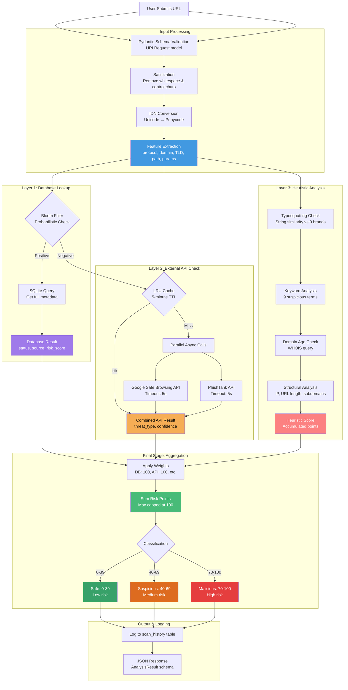
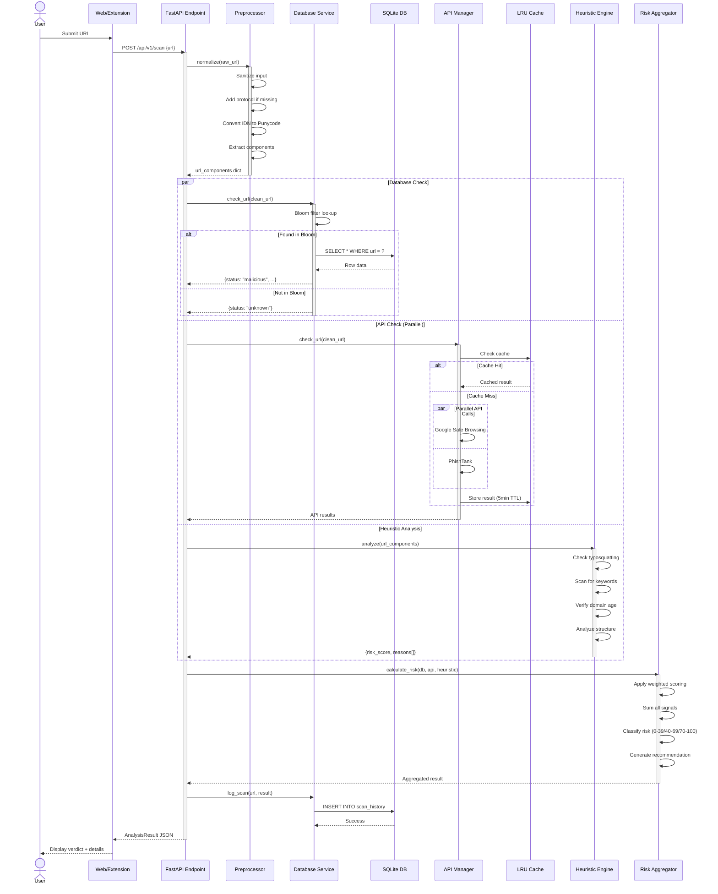
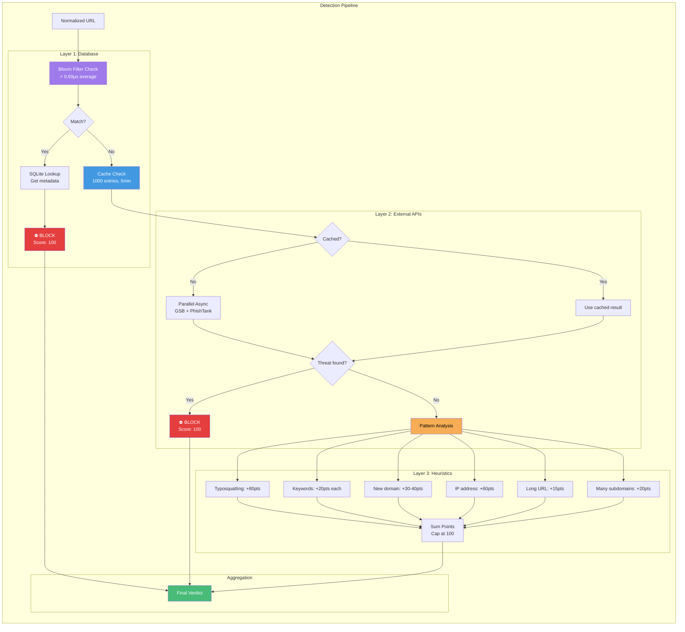
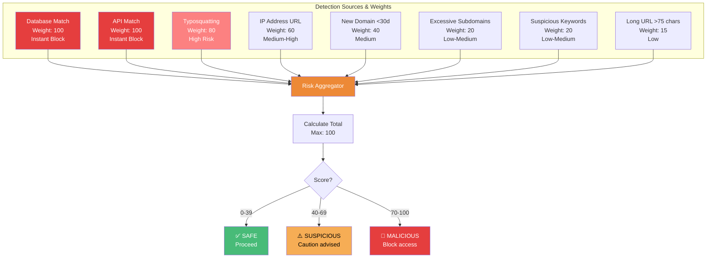
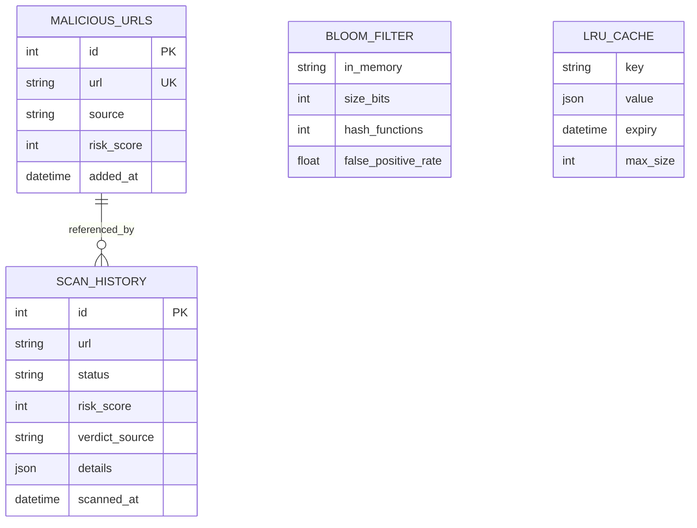
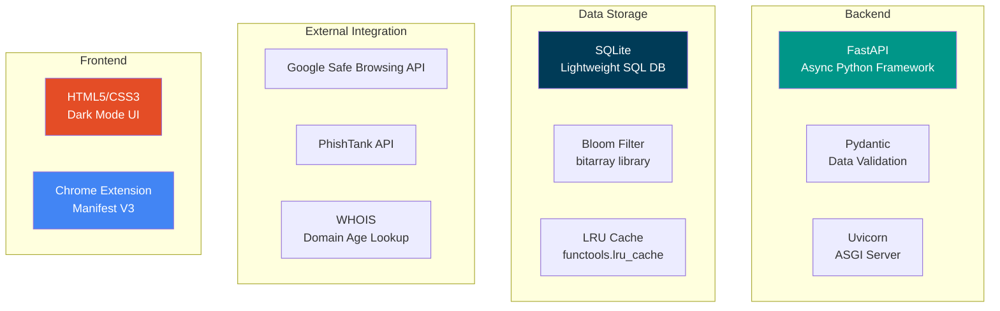

# Phishing Detection System - Architecture & Flow Diagrams
## Technical Overview with Clear Explanations

This document provides a comprehensive view of the system architecture, data flow, and workflows with technical accuracy while maintaining clarity.

---

## 1. High-Level System Architecture

```mermaid
graph TB
    subgraph "Client Layer"
        WEB[Web Dashboard<br/>React/HTML5<br/>Port: 8000/]
        EXT[Chrome Extension<br/>Manifest V3<br/>Real-time Monitoring]
    end
    
    subgraph "API Layer - FastAPI"
        ROUTER[API Router<br/>/api/v1/scan]
        ENDPOINTS[Endpoint Handlers<br/>Request Validation]
        SCHEMAS[Pydantic Schemas<br/>URLRequest/AnalysisResult]
    end
    
    subgraph "Service Layer"
        PREPROC[URL Preprocessor<br/>- Sanitization<br/>- IDN Conversion<br/>- Feature Extraction]
        
        DB_SVC[Database Service<br/>- Bloom Filter<br/>- SQLite Queries<br/>- Scan Logging]
        
        API_SVC[API Integration<br/>- Google Safe Browsing<br/>- PhishTank<br/>- LRU Cache (5min TTL)]
        
        HEUR_SVC[Heuristic Engine<br/>- Typosquatting<br/>- Keyword Detection<br/>- Domain Age (WHOIS)<br/>- Structural Analysis]
        
        AGG_SVC[Risk Aggregator<br/>- Weighted Scoring<br/>- Classification Logic<br/>- Recommendation Engine]
    end
    
    subgraph "Data Layer"
        SQLITE[(SQLite Database<br/>malicious_urls<br/>scan_history)]
        BLOOM[Bloom Filter<br/>In-Memory<br/>Fast Lookup]
        CACHE[LRU Cache<br/>1000 entries<br/>Thread-safe]
    end
    
    subgraph "External APIs"
        GSB[Google Safe Browsing]
        PT[PhishTank]
    end
    
    WEB -->|HTTP POST| ROUTER
    EXT -->|HTTP POST| ROUTER
    ROUTER --> ENDPOINTS
    ENDPOINTS --> SCHEMAS
    ENDPOINTS --> PREPROC
    
    PREPROC --> DB_SVC
    PREPROC --> API_SVC
    PREPROC --> HEUR_SVC
    
    DB_SVC <--> SQLITE
    DB_SVC <--> BLOOM
    
    API_SVC -.->|Async| GSB
    API_SVC -.->|Async| PT
    API_SVC <--> CACHE
    
    DB_SVC --> AGG_SVC
    API_SVC --> AGG_SVC
    HEUR_SVC --> AGG_SVC
    
    AGG_SVC --> SCHEMAS
    SCHEMAS --> ENDPOINTS
    ENDPOINTS -->|JSON Response| WEB
    ENDPOINTS -->|JSON Response| EXT
    
    style WEB fill:#4299e1,stroke:#2c5282,color:#fff
    style EXT fill:#4299e1,stroke:#2c5282,color:#fff
    style ROUTER fill:#48bb78,stroke:#2f855a,color:#fff
    style AGG_SVC fill:#ed8936,stroke:#c05621,color:#fff
    style DB_SVC fill:#9f7aea,stroke:#6b46c1,color:#fff
    style API_SVC fill:#f6ad55,stroke:#dd6b20,color:#000
    style HEUR_SVC fill:#fc8181,stroke:#c53030,color:#fff
```

**Architecture Highlights:**
- **Client Layer**: Web dashboard + Chrome extension for user interaction
- **API Layer**: FastAPI with async support, Pydantic validation
- **Service Layer**: 5 core services handling different detection aspects
- **Data Layer**: SQLite for persistence, Bloom filter for speed, LRU cache for APIs
- **External Layer**: Integration with Google Safe Browsing and PhishTank

---

## 2. Request Processing Flow



---

## 3. Detailed Sequence Diagram



---

## 4. Detection Layers Detail



---

## 5. Risk Scoring Matrix



---

## 6. Performance Breakdown

```mermaid
gantt
    title Processing Time per Layer (milliseconds)
    dateFormat X
    axisFormat %L ms
    
    section Preprocessing
    Sanitization          :0, 1
    IDN Conversion        :1, 1
    Feature Extraction    :1, 1
    
    section Detection Layers
    Bloom Filter Check    :2, 1
    SQLite Query          :2, 1
    API Cache Check       :3, 1
    External API Calls    :3, 4
    Heuristic Analysis    :3, 2
    
    section Aggregation
    Weight Calculation    :7, 1
    Classification        :7, 1
    
    section Output
    Database Logging      :8, 1
    Response Generation   :8, 1
```



**Performance Metrics:**
- **Preprocessing**: ~1ms (sanitization, IDN, extraction)
- **Database Layer**: <1ms (Bloom + SQLite)
- **API Layer**: ~1.6ms (cached) / ~4ms (fresh)
- **Heuristic Layer**: ~1-2ms
- **Total**: ~6-8ms (fresh) / ~3-5ms (cached)

---

## 7. Data Schema Overview



**Database Details:**
- **malicious_urls**: Known phishing/malicious sites
- **scan_history**: Audit log of all scans performed
- **Bloom Filter**: In-memory probabilistic data structure
- **LRU Cache**: Time-limited cache for API responses

---

## 8. Real-World Processing Example

```mermaid
flowchart TB
    START["Input URL:<br/>http://paypa1-verify.com/login"] --> PREP
    
    PREP[Preprocessing<br/>✓ Clean URL<br/>✓ Extract domain: paypa1-verify.com<br/>✓ TLD: .com<br/>✓ Path: /login] --> CHECK
    
    CHECK[Run All Checks]
    
    CHECK --> DB[Database Check<br/>❌ Not in Bloom filter<br/>❌ Not in SQLite<br/>Points: 0]
    
    CHECK --> API[API Check<br/>❌ Google: No threat<br/>❌ PhishTank: Unknown<br/>Points: 0]
    
    CHECK --> HEUR[Heuristic Check<br/>✓ Typo: paypa1 vs paypal (83% similar)<br/>✓ Keyword: 'verify' detected<br/>✓ Domain age: 12 days old<br/>✓ Structure: Normal]
    
    DB --> AGG
    API --> AGG
    HEUR --> AGG
    
    AGG[Risk Aggregation<br/>━━━━━━━━━━━━━━━<br/>Typosquatting: +80<br/>Keyword 'verify': +20<br/>New domain <30d: +40<br/>━━━━━━━━━━━━━━━<br/>Total: 140 → Capped at 100]
    
    AGG --> RESULT[Final Verdict<br/>━━━━━━━━━━━━━<br/>Status: MALICIOUS<br/>Score: 100/100<br/>Source: Heuristic Analysis<br/>━━━━━━━━━━━━━<br/>Reasons:<br/>• Domain mimics PayPal<br/>• Contains verification keyword<br/>• Domain created recently]
    
    RESULT --> OUTPUT[Response to User<br/>🔴 DANGEROUS - DO NOT VISIT<br/>This appears to be a phishing attempt]
    
    style PREP fill:#4299e1,color:#fff
    style HEUR fill:#fc8181,color:#fff
    style AGG fill:#ed8936,color:#fff
    style RESULT fill:#e53e3e,color:#fff
    style OUTPUT fill:#c53030,color:#fff
```

---

## Component Responsibilities

| Component | Responsibility | Performance |
|-----------|---------------|-------------|
| **Preprocessor** | URL sanitization, IDN conversion, feature extraction | <1ms |
| **Database Service** | Bloom filter + SQLite lookups, scan logging | <1ms |
| **API Manager** | Parallel async calls to GSB/PhishTank, caching | 1.6-4ms |
| **Heuristic Engine** | Pattern matching, domain analysis, structural checks | 1-2ms |
| **Risk Aggregator** | Weighted scoring, classification, recommendations | <1ms |

---

## Technology Stack



---

## Key Takeaways

- **Multi-Layer Defense**: 3 independent detection layers ensure comprehensive coverage
- **Fast Performance**: Sub-second response time with intelligent caching
- **Weighted Scoring**: Transparent risk calculation based on multiple signals
- **Async Processing**: Parallel API calls maximize throughput
- **Bloom Filter**: Probabilistic data structure enables microsecond lookups
- **Graceful Degradation**: System functions even if external APIs are unavailable

---

*This balanced documentation provides technical accuracy while maintaining readability for developers, security analysts, and technical stakeholders.*
