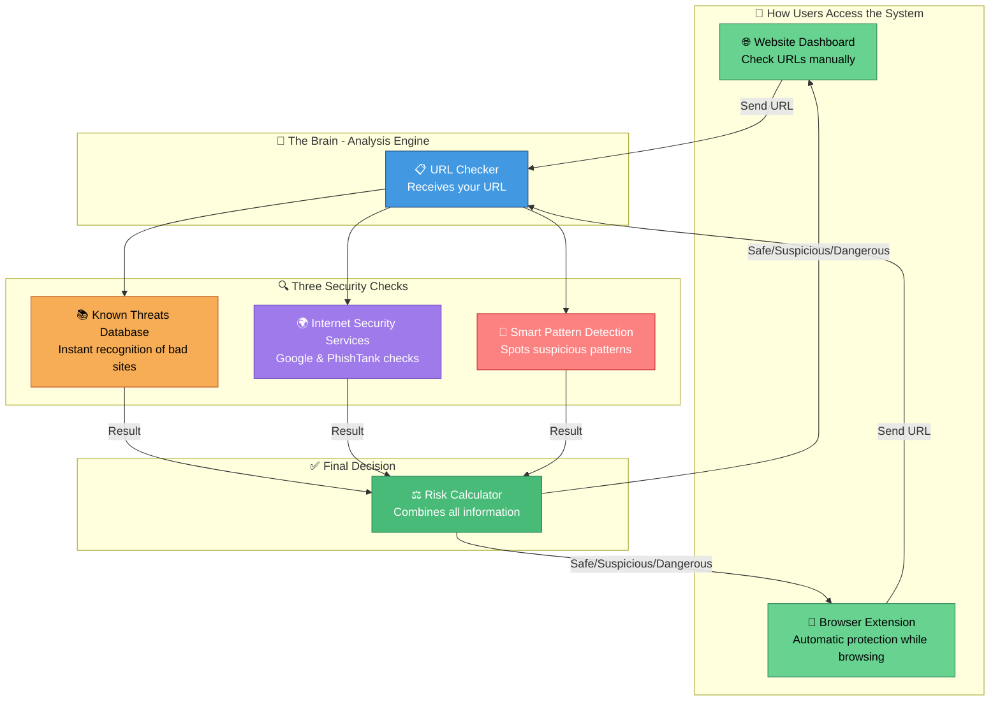
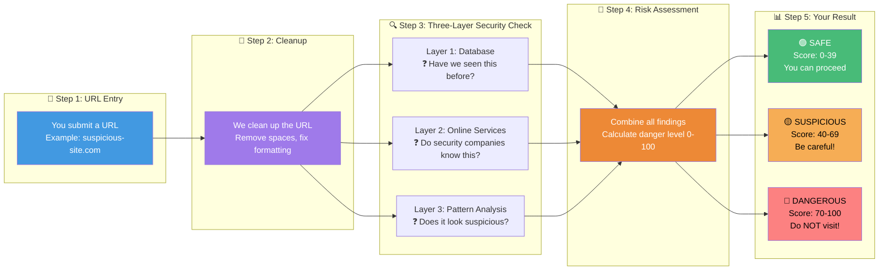
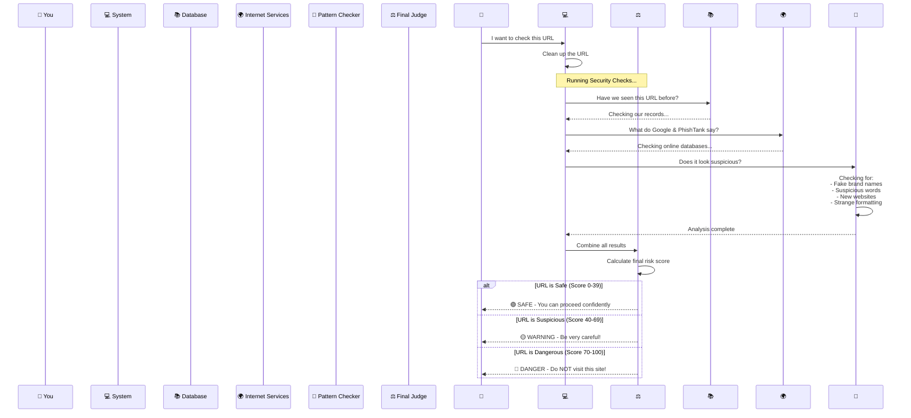
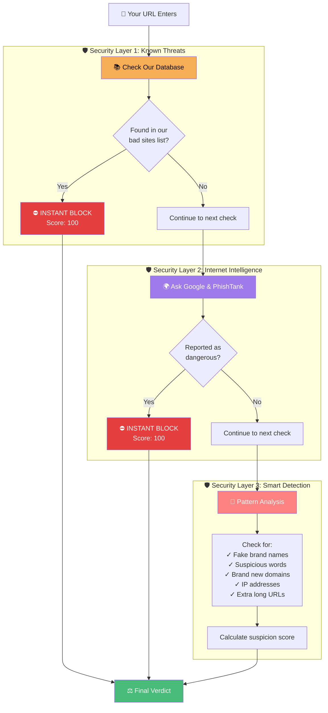
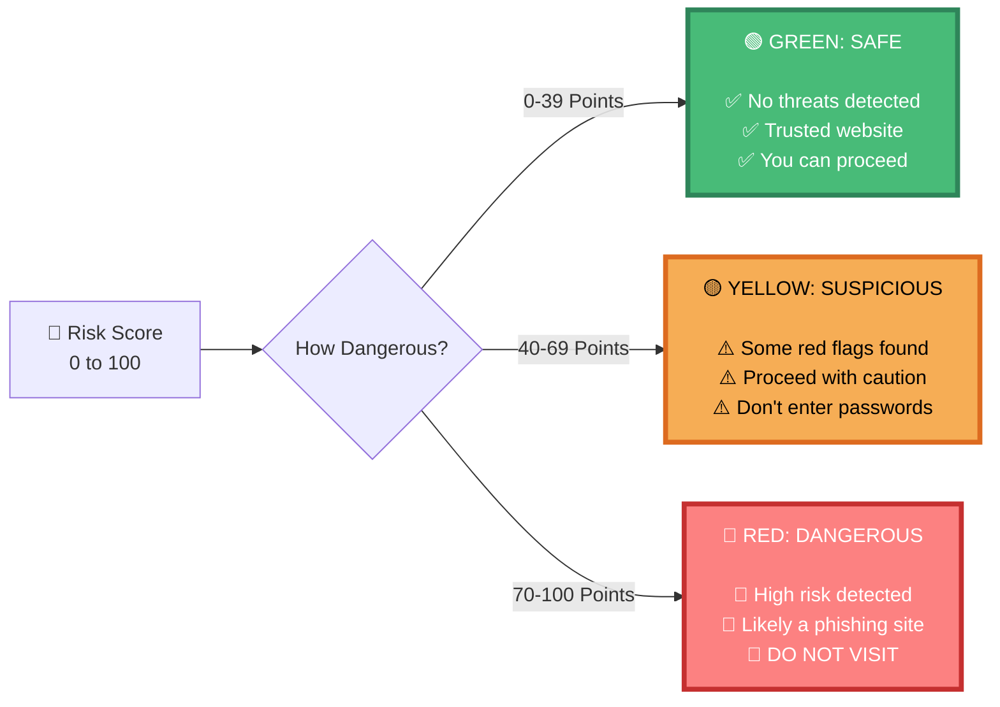
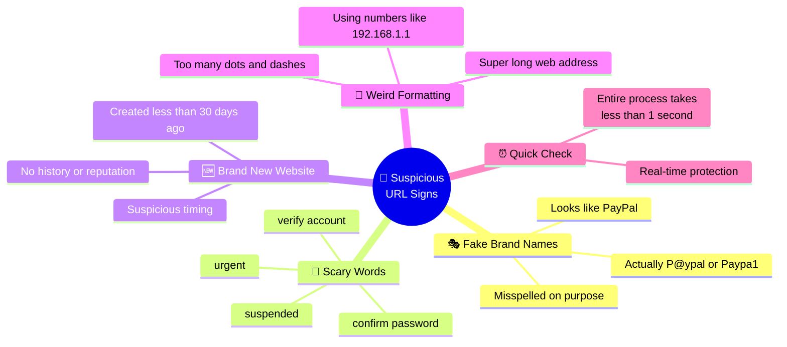
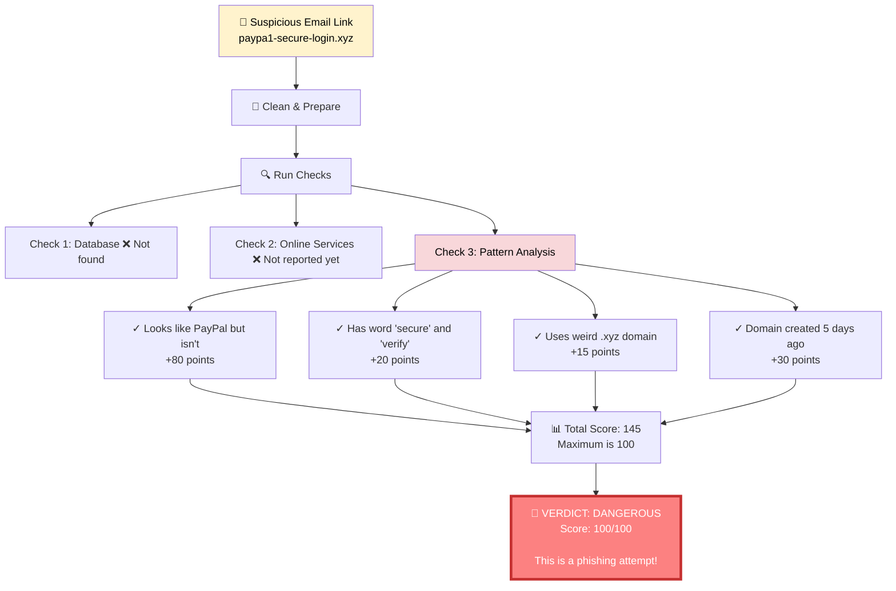
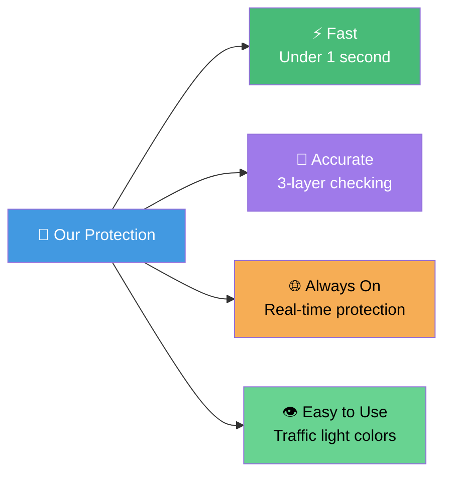

# Phishing Detection System - Simplified Diagrams
## Easy-to-Understand Visual Guide for Non-Technical Users

This document explains how our phishing detection system works using simple terms and visual diagrams.

---

## 1. System Overview - What Components Work Together?

**In Simple Terms:**
- You can use either our **website** or **browser extension** to check URLs
- Your URL goes through **3 different security checks**
- A **risk calculator** combines all the results to give you a final answer

---

## 2. How Your URL Is Analyzed - The Journey

**The Journey Explained:**
1. **You enter a URL** - Type it in our website or our extension detects it automatically
2. **We clean it up** - Remove extra spaces, make sure it's formatted correctly
3. **Three security checks run** - Like having 3 security guards checking the same door
4. **We calculate the risk** - Give it a score from 0 (very safe) to 100 (very dangerous)
5. **You get a clear answer** - Green = safe, Yellow = be careful, Red = dangerous!

---

## 3. What Happens Behind the Scenes?

**Step-by-Step Breakdown:**
1. **You submit a URL** to check
2. **System prepares** the URL for analysis
3. **Three checks happen simultaneously:**
   - Checking our own database of known bad sites
   - Asking internet security companies for their opinion
   - Looking for suspicious patterns in the URL itself
4. **All results are combined** into one final score
5. **You receive a clear verdict** with color-coded advice

---

## 4. Security Check Layers Explained Simply

---

## 5. Risk Score Explained - Traffic Light System

**Think of it like a traffic light:**
- 🟢 **Green (Safe)** = Go ahead, it's safe
- 🟡 **Yellow (Suspicious)** = Slow down, be careful
- 🔴 **Red (Dangerous)** = STOP! Don't go there!

---

## 6. What Makes a URL Suspicious?

---

## 7. How Fast Is the System?

```mermaid
gantt
    title ⏱️ Analysis Speed (Everything happens in under 1 second!)
    dateFormat X
    axisFormat %L ms
    
    section Process
    Clean up URL           :0, 1
    Check Database        :1, 1
    Check Internet APIs   :2, 4
    Pattern Analysis      :2, 2
    Calculate Final Score :6, 1
    
    section Result
    Show You the Answer   :7, 1
```

**Speed Breakdown:**
- **Instant** - Less than 1 second total
- **Real-time** - Protection while you browse
- **Efficient** - Doesn't slow down your browsing

---

## 8. Real-World Example

Let's say you receive an email with this link: `http://paypa1-secure-login.xyz/verify`

**What We Found:**
1. Looks like "PayPal" but spelled "Paypa1" (with number 1)
2. Uses suspicious words like "secure" and "verify"
3. Strange .xyz domain instead of .com
4. Website created just 5 days ago

**Result: 🔴 DANGEROUS - This is definitely a phishing site!**

---

## Key Takeaways for Everyone

### Remember:
- 🟢 **Green** = Safe to visit
- 🟡 **Yellow** = Be very careful
- 🔴 **Red** = Don't visit this site!

### The system checks:
1. ✅ Our database of known bad sites
2. ✅ What internet security companies say
3. ✅ Patterns that look suspicious

### All in less than 1 second! ⚡

---

*This simplified guide helps everyone understand how we protect you from phishing attacks, without needing any technical knowledge.*
